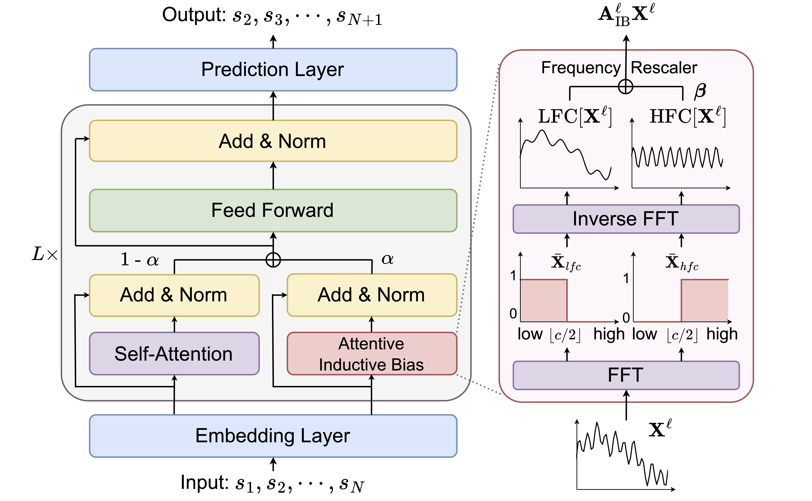

# BSARec
This is the official source code for our AAAI 2024 Paper ["An Attentive Inductive Bias for Sequential Recommendation beyond the Self-Attention"](https://arxiv.org/abs/2312.10325)

## Overview
Beyond Self-Attention for Sequential Recommendation (BSARec) leverages Fourier transform to strike a balance between our inductive bias and self-attention.


## Updates
- (Oct 18, 2024) correct default argument for layer-specific values in FEARec
- (Oct 18, 2024) rename variables in model checkpoint
- (Oct 18, 2024) organize layer classes within each model file
- (Sep 14, 2024) add data processing code
- (Apr 20, 2024) rename variable 'beta' to 'sqrt_beta'
- (Apr 16, 2024) add visualization code for figure 3

## Dataset
In our experiments, we utilize six datasets, all stored in the `src/data` folder. 
- For the Beauty, Sports, Toys, and Yelp datasets, we employed the datasets downloaded from [this repository](https://github.com/Woeee/FMLP-Rec). 
- For ML-1M and LastFM, we processed the data according to the procedure outlined in [this code](https://github.com/RUCAIBox/CIKM2020-S3Rec/blob/master/data/data_process.py).
- The `src/data/*_same_target.npy` files are utilized for training DuoRec and FEARec, both of which incorporate contrastive learning.

## Quick Start
### Environment Setting
```
conda env create -f bsarec_env.yaml
conda activate bsarec
```

### How to train BSARec
- Note that pretrained model (.pt) and train log file (.log) will saved in `src/output`
- `train_name`: name for log file and checkpoint file
```
python main.py  --data_name [DATASET] \
                --lr [LEARNING_RATE] \
                --alpha [ALPHA] \ 
                --c [C] \
                --num_attention_heads [N_HEADS] \
                --train_name [LOG_NAME]
```
- Example for Beauty
```
python main.py  --data_name Beauty \
                --lr 0.0005 \
                --alpha 0.7 \
                --c 5 \
                --num_attention_heads 1 \
                --train_name BSARec_Beauty
```

### How to test pretrained BSARec
- Note that pretrained model (.pt file) must be in `src/output`
- `load_model`: pretrained model name without .pt
```
python main.py  --data_name [DATASET] \
                --alpha [ALPHA] \ 
                --c [C] \
                --num_attention_heads [N_HEADS] \
                --load_model [PRETRAINED_MODEL_NAME] \
                --do_eval
```
- Example for Beauty
```
python main.py  --data_name Beauty \
                --alpha 0.7 \
                --c 5 \
                --num_attention_heads 1 \
                --load_model BSARec_Beauty_best \
                --do_eval
```

### How to train the baselines
- You can easily train the baseline models used in BSARec by changing the `model_type` argument.
    - `model_type`: Caser, GRU4Rec, SASRec, BERT4Rec, FMLPRec, DuoRec, FEARec
- For the hyperparameters for the baselines, check the `parse_args()` function in `src/utils.py`.
```
python main.py  --model_type SASRec \
                --data_name Beauty \
                --num_attention_heads 1 \
                --train_name SASRec_Beauty
```

## Citation
If you find our work useful, please consider citing our paper:
```
@inproceedings{shin2024bsarec,
title={An attentive inductive bias for sequential recommendation beyond the self-attention},
author={Shin, Yehjin and Choi, Jeongwhan and Wi, Hyowon and Park, Noseong},
booktitle={Proceedings of the AAAI Conference on Artificial Intelligence},
volume={38},
number={8},
pages={8984--8992},
year={2024}
}
```

## Contact
If you have any inquiries regarding our paper or codes, feel free to reach out via email at yehjin.shin@yonsei.ac.kr.

## Acknowledgement
This repository is based on [FMLP-Rec](https://github.com/Woeee/FMLP-Rec).
